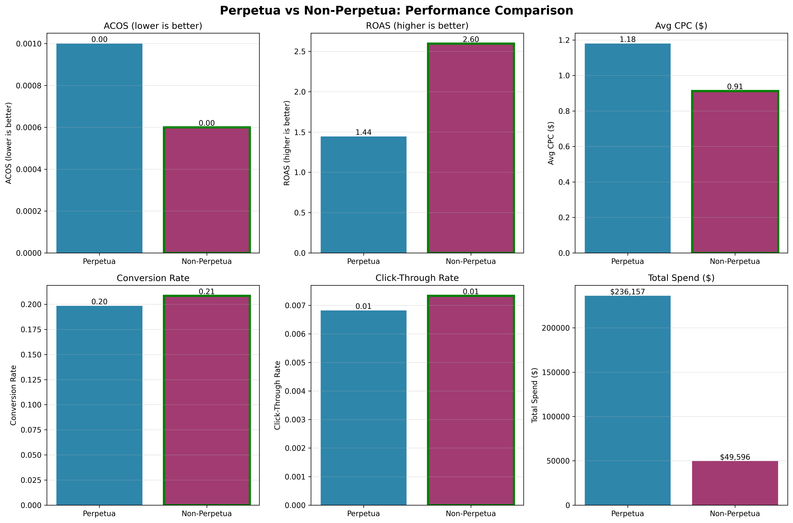
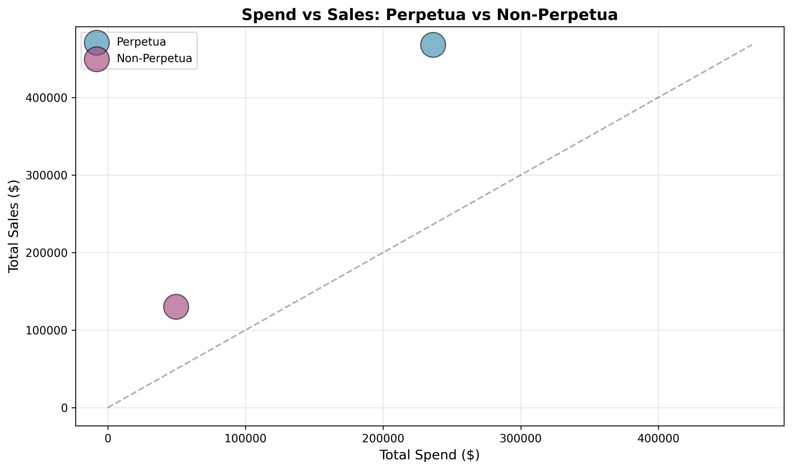
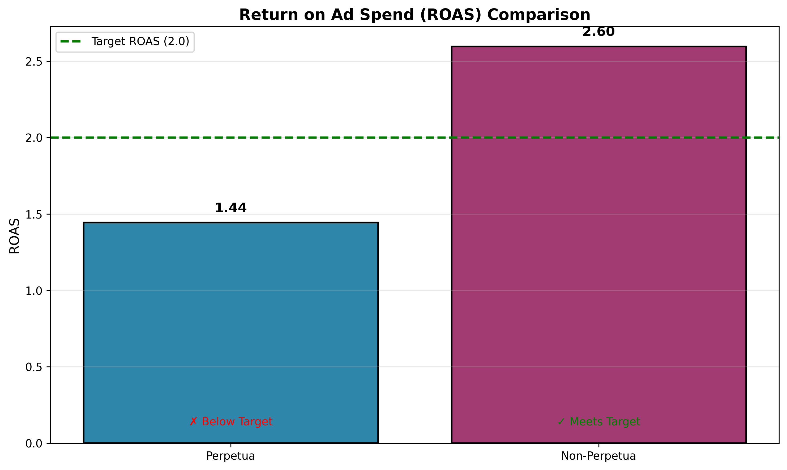
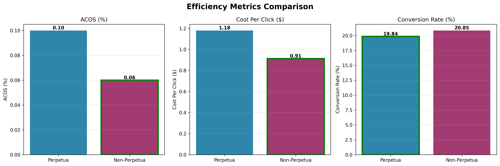

# Campaign Performance Analysis: Perpetua vs Non-Perpetua

**Report Generated:** 2026-02-02 03:36:02

## Executive Summary

- **Perpetua ASINs Analyzed:** 227
- **Non-Perpetua ASINs Analyzed:** 193

## Performance Comparison

| Metric | Perpetua | Non-Perpetua | Winner |
|--------|----------|--------------|--------|
| Total Spend | \$236,157.39 | \$49,596.13 | Perpetua ✓ |
| Total Sales | \$467,827.25 | \$130,338.64 | Perpetua ✓ |
| Total Orders | 39,717 | 11,329 | Perpetua ✓ |
| ACOS | 0.10% | 0.06% | Non-Perpetua ✓ |
| ROAS | 1.44x | 2.60x | Non-Perpetua ✓ |
| Avg CPC | \$1.18 | \$0.91 | Non-Perpetua ✓ |
| Conversion Rate | 19.84% | 20.85% | Non-Perpetua ✓ |
| CTR | 0.68% | 0.73% | Non-Perpetua ✓ |

## Key Insights

  ⚠ Non-Perpetua has 66.7% better ACOS
  ⚠ Non-Perpetua has 44.4% better ROAS
  ⚠ Non-Perpetua has 29.3% lower CPC
  • Perpetua spends 376% more than non-Perpetua products
  • Perpetua generates 259% more sales revenue
  • Perpetua manages 227 ASINs vs 193 non-Perpetua ASINs

Per-ASIN Metrics:
  • Perpetua: $1,040 spend/ASIN → $2,061 sales/ASIN
  • Non-Perpetua: $257 spend/ASIN → $675 sales/ASIN

## Visualizations

### Perpetua vs Non-Perpetua Comparison

### Spend vs Sales

### ROAS Comparison

### Efficiency Metrics
